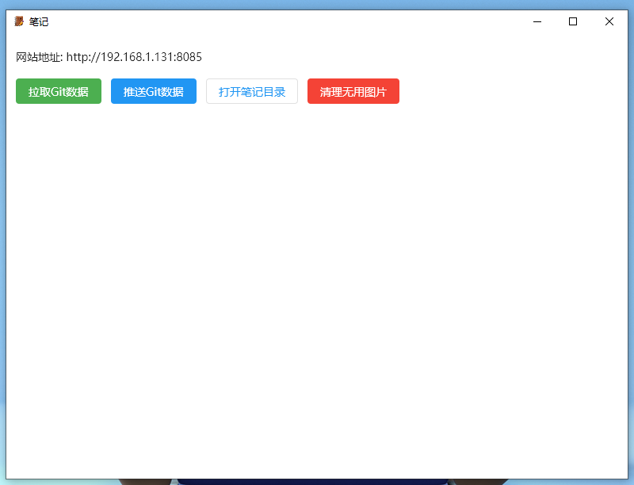
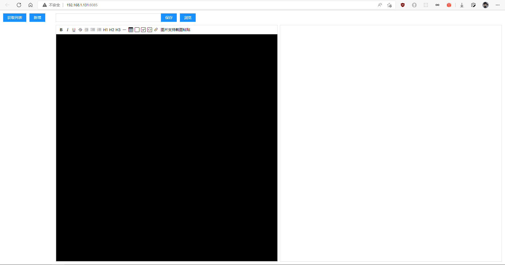

# note_flutter 笔记

## 基于flutter+web技术开发的笔记

## 拉取和推送笔记
- 需要安装git软件
- 需要在gitee或者github网站建立仓库
- 克隆建立的仓库
- 打开仓库复制.git文件夹到软件目录下的data\flutter_assets\note_data目录下

## 笔记图片支持截图粘贴
- note_data\notes 存放笔记文件
- note_data\images 存放图片文件

## 服务端

## web端

